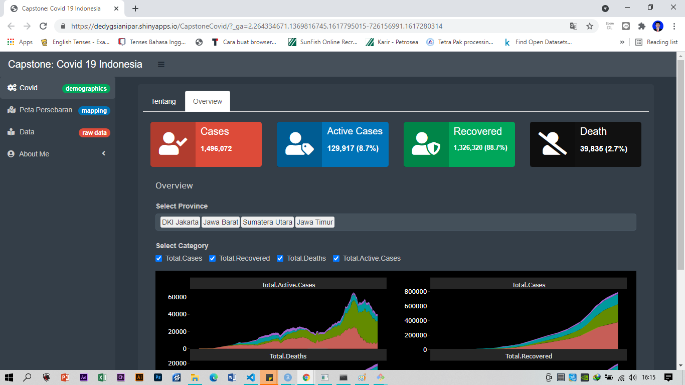

# COVID-19 Dashboard Monitoring

Dashboard monitoring the situation of covid-19 in Indonesia specifically. Built using Shiny and Shinydashboard in R. This project aims to provide the information visually the total number of confirmed cases, recovered, and death.

*Link*:  https://dedygsianipar.shinyapps.io/CapstoneCovid/

## dataset

data obtained from the web Kaggle.com
